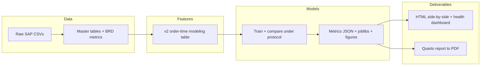
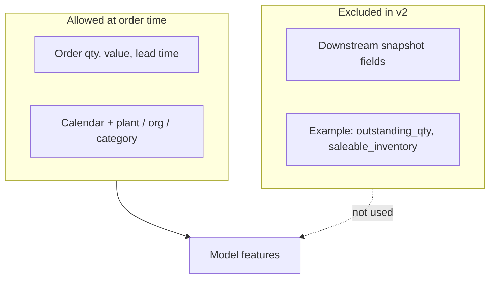
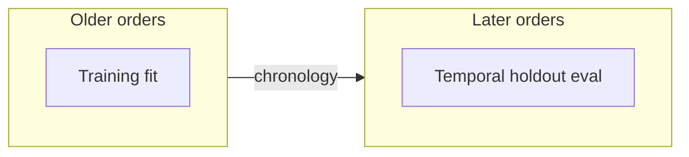
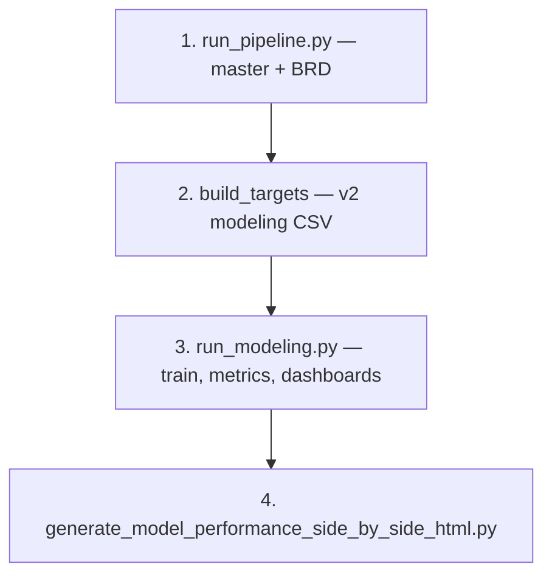

# Predictive supply chain analytics · SAP backorder risk

| Field | Detail |
| --- | --- |
| **Institution** | Westminster University |
| **Course** | DATA-470 · Data Science Capstone |
| **Term** | Spring 2026 |
| **Student** | Addy Cruz |
| **Instructor** | Dr. Liang Jingsai |

> **Project:** Order-time binary classification of backorder risk from SAP-style ERP extracts, with a reproducible Python pipeline, temporal validation, and frozen reporting artifacts (HTML / Quarto PDF).

---

## Contents

- [Project overview](#project-overview)
- [Source of truth](#source-of-truth)
- [Problem framing](#problem-framing)
- [Why `v2`](#why-v2)
- [Temporal holdout](#temporal-holdout-plain-english)
- [Model comparison](#model-comparison)
- [Canonical workflow](#canonical-workflow)
- [Validate (SSVC)](#validate-ssvc)
- [Key files](#key-files)
- [Quick start](#quick-start)
- [End-to-end (dependency order)](#end-to-end-dependency-order)
- [Project structure](#project-structure)
- [License](#license)

---

## Project overview

This repository is the **authoritative capstone workspace** for Westminster DATA-470 (Spring 2026): a full stack from curated SAP BigQuery tables through leakage-aware features, model training, threshold analysis, and publication-ready outputs.

End-to-end flow (high level):



---

## Source of truth

This repository treats `v2` as the only official modeling path.

- Official modeling table: `data/processed/master_order_fulfillment_modeling_v2_ordertime.csv`
- Official target: `target_backorder_risk`
- Official task: binary classification
  `backorder` vs `no backorder`
- Official model comparison (poster headlines):
  `logistic_regression` vs `xgboost` vs `oof_calibrated_stack` (selected champion, inner-temporal rule)
- `lightgbm` and `catboost` are base learners inside the OOF-calibrated stack; reported in the full comparison table but not poster headlines.
- Deployment status is reported honestly (precision + recall floors); see `docs/md/v2_model_truth.md` for the current champion and gate result.

Older snapshot-style experiments and `v1.1` are not part of the current project story.

---

## Problem framing

The capstone answers two questions in order:

1. Will this order line become a backorder?
2. If yes, by how much?

The main project result is the first question. The regression piece is secondary.

---

## Why `v2`

`v2` uses only information that is available at order time. That makes it more defensible than snapshot variants that include fields too close to the label definition.



In practice, this means the model can use order-time business context such as:

- order quantity
- confirmed quantity
- net value
- requested lead time
- order calendar features
- basic categorical context like plant, division, item category, and sales organization

It does not use downstream snapshot fields like `outstanding_qty` or `saleable_inventory`.

---

## Temporal holdout, plain English

The temporal split is simple:

- train on older orders
- test on later orders



That is all it means. It is just a more realistic check of whether the model would still work on future orders.

---

## Model comparison

Candidates can include several tabular models (see the cockpit). The narrative should stay disciplined:

| Model | Role | Why it is here |
| --- | --- | --- |
| `logistic_regression` | Baseline | Simple, interpretable, easy to defend |
| `lightgbm` | Challenger | Captures non-linear patterns in tabular data |
| Other challengers (e.g. `catboost`, ensembles) | Optional | Compared under the same protocol when enabled |

**Champion rule:** The primary model is selected from **inner temporal validation** on temporal-train rows only (`selected_model` in `models/classification_metrics_v2_ordertime.json`). **Temporal holdout** is the main forward-time evaluation for reporting—not the place to pick architecture by peeking. Group / recent splits are diagnostic. Full wording: `docs/md/modeling_experiment_protocol.md` section 9.

---

## Canonical workflow



1. Build pipeline tables.
2. Build the `v2` order-time modeling table.
3. Train and compare models under the protocol; confirm `selected_model` reflects inner-temporal choice.
4. Report temporal holdout metrics for the selected model; use `scripts/generate_model_health_dashboard.py` for a frozen HTML checkpoint when desired.

---

## Validate (SSVC)

Workflow **Validate** for Markdown in this repo (structure only: **MD036** no emphasis-as-heading, **MD060** table pipe spacing). Paths under `poster/` are excluded (same as push policy). Requires Node.js `npx`.

```bash
make validate
# or: ./scripts/ssvc_validate.sh
```

Config: [`.markdownlint-cli2.yaml`](.markdownlint-cli2.yaml) (only those rules are enabled so long prose lines do not fail the check).

---

## Key files

| Path | Purpose |
| --- | --- |
| `docs/md/v2_model_truth.md` | Short canonical summary of the official modeling story |
| `docs/md/showcase_application_templates.md` | Optional abstract and poster copy (symposium-style); venue-neutral |
| `requirements-v2.txt` | Minimal package set for the official `v2` workflow |
| `src/features/build_targets.py` | Builds the official `v2` order-time modeling table |
| `src/models/v2_ordertime/` | Separate LR and LightGBM pipeline modules, shared preprocessing + evaluation; `classifier_registry.py` wires both |
| `src/models/backorder_modeling.py` | Dataset prep, splits, orchestration, artifacts (imports `v2_ordertime` for models) |
| `scripts/run_modeling.py` | **Canonical** modeling run: train/eval, threshold report, model health dashboard |
| `scripts/run_overfit_eval.py` | Optional **minimal** retrain (metrics only); prefer `run_modeling.py` for full artifacts |
| `scripts/run_v2_full_chain.sh` | Runs data → targets → modeling → HTML → **notebook `.py` replacements** (EDA + summaries) |
| `scripts/run_notebook_replacements.py` | EDA + report summaries (replaces removed notebooks; `discovery_*.png`, CSVs, figure checks) |
| `scripts/generate_model_performance_side_by_side_html.py` | Writes a simple comparison report |
| `models/classification_metrics_v2_ordertime.json` | Main saved classification metrics |

---

## Quick start

```bash
python3.12 -m venv .venv-v2
source .venv-v2/bin/activate
pip install -r requirements-v2.txt
python run_pipeline.py
python -m src.features.build_targets
python scripts/run_modeling.py
python scripts/generate_model_performance_side_by_side_html.py
python scripts/run_notebook_replacements.py
```

---

## End-to-end (dependency order)

Run steps **in this order**; each step assumes the previous outputs exist under `data/processed/`.

| Step | What it does |
| --- | --- |
| 1 | `python run_pipeline.py` — master tables + BRD metrics |
| 2 | `python -m src.features.build_targets` — **`master_order_fulfillment_modeling_v2_ordertime.csv`** (+ other targets) |
| 3 | `python scripts/run_modeling.py` — metrics JSON, figures, joblib models |
| 4 | `python scripts/generate_model_performance_side_by_side_html.py` — `docs/html/Model-Performance-SideBySide.html` |

**One shot** (uses `.venv-v2/bin/python` if present):

```bash
chmod +x scripts/run_v2_full_chain.sh
./scripts/run_v2_full_chain.sh
```

**Make** (same order; set `V2PY` if not using `.venv-v2`):

```bash
make v2-all
# or stepwise: make v2-data && make v2-targets && make v2-model && make v2-report
```

---

## Project structure

```text
DATA-470_DSCapstone/
├── config/
├── data/
│   ├── raw/
│   ├── clean/
│   └── processed/
├── docs/
├── models/
├── output/
├── report/
├── scripts/          # v2 pipeline + analysis (no poster scripts here)
├── tools/
│   └── poster/         # optional showcase poster stack (see tools/poster/README.md)
├── src/
└── tests/
```

---

## License

MIT — see [LICENSE](LICENSE).
