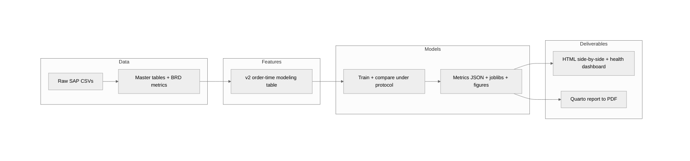
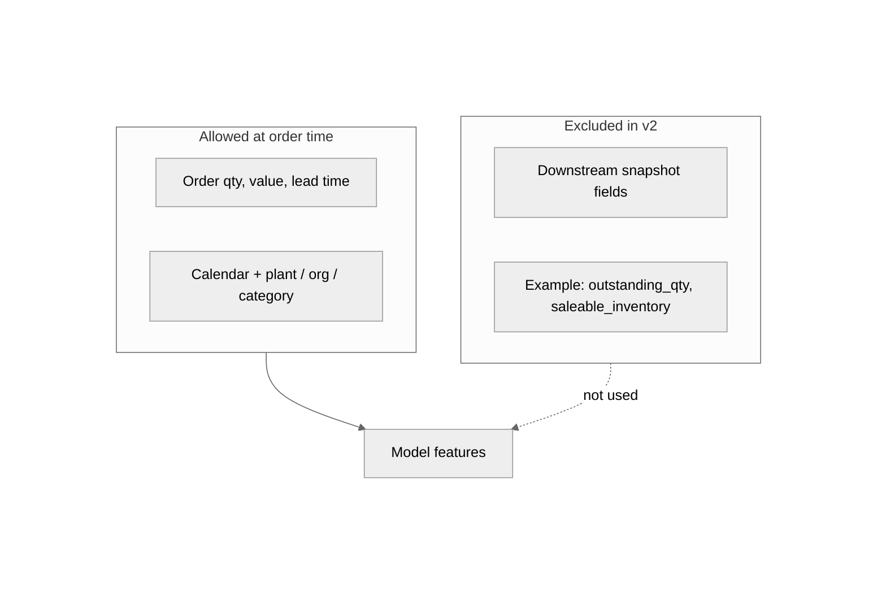
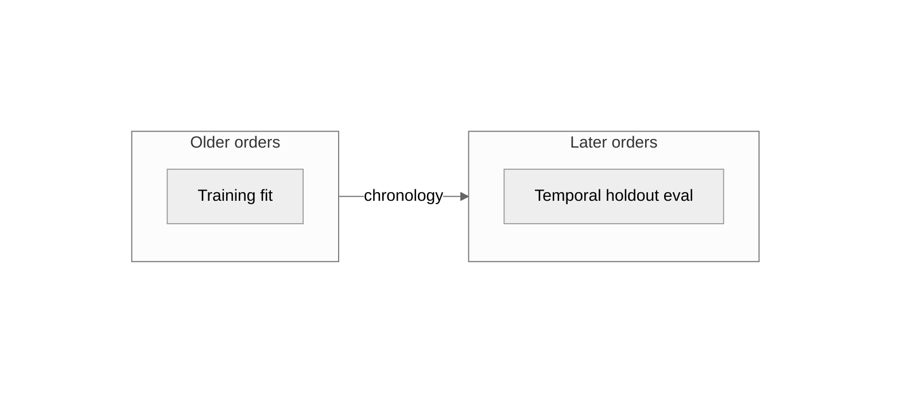
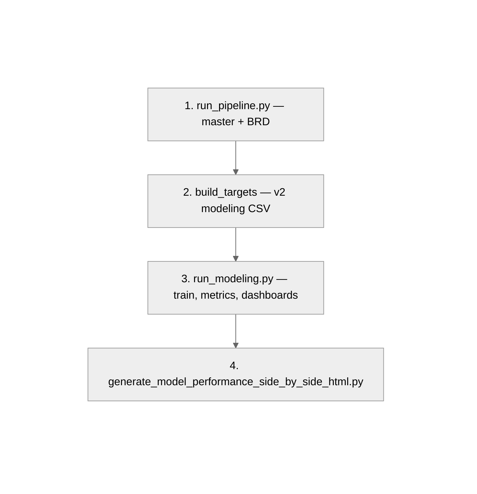

# Predictive supply chain analytics · SAP backorder risk

<p align="center">
  
  
  
  
</p>

<p align="center"><strong>Westminster University · Data Science Capstone · Spring 2026</strong> · <code>SAP Backorder Classifier</code></p>

---

## Contents

| Section | Purpose |
| :-- | :-- |
| [Overview](#overview) | Capstone scope and audience |
| [Workflow](#workflow) | Reproduce the official v2 pipeline |
| [Architecture](#architecture) | End-to-end and modeling diagrams |
| [Deep dive](#deep-dive) | Problem framing, models, key files |
| [References](#references) | Reports, truth docs, license |

---

## Overview

| Field | Value |
| :-- | :-- |
| **Audience** | Recruiters, reviewers, and engineers evaluating reproducible ML on ERP-style order data |
| **Goal** | Order-time binary classification of SAP-style backorder risk with leakage-aware features, temporal validation, and frozen reporting artifacts |
| **Owner** | Addy Cruz (Westminster University, DATA-470, Dr. Liang Jingsai) |

This repository is the **authoritative capstone workspace** for Westminster DATA-470 (Spring 2026): curated SAP tables through leakage-aware features, model training, threshold analysis, and publication-ready HTML / Quarto outputs.

> [!IMPORTANT]
> Git tracks pipeline code, configs, frozen metrics, and reports — **not** raw SAP CSVs. Download inputs per [data/README.md](data/README.md).

---

## Workflow

- [ ] Download raw SAP tables into `data/raw/` ([Kaggle source](https://www.kaggle.com/datasets/mustafakeser4/sap-dataset-bigquery-dataset))
- [ ] Create venv and install: `pip install -r requirements-v2.txt`
- [ ] Run end-to-end: `make v2-all` or `./scripts/run_v2_full_chain.sh`
- [ ] Validate: `make validate`
- [ ] Confirm champion and gates: [docs/md/v2_model_truth.md](docs/md/v2_model_truth.md)

---

## Architecture

End-to-end capstone flow:



Order-time feature boundary (`v2`):



Temporal holdout (plain English: train on older orders, test on later orders):



Canonical pipeline steps:



---

## Deep dive

### Institution

| Field | Detail |
| :-- | :-- |
| **Institution** | Westminster University |
| **Course** | DATA-470 · Data Science Capstone |
| **Term** | Spring 2026 |
| **Student** | Addy Cruz |
| **Instructor** | Dr. Liang Jingsai |

### Source of truth

This repository treats `v2` as the only official modeling path.

- Official modeling table: `data/processed/master_order_fulfillment_modeling_v2_ordertime.csv` (generated locally)
- Official target: `target_backorder_risk`
- Official task: binary classification (`backorder` vs `no backorder`)
- Poster headline triad: `logistic_regression` vs `xgboost` vs `oof_calibrated_stack` (selected champion, inner-temporal rule)
- `lightgbm` and `catboost` are base learners inside the OOF-calibrated stack
- Deployment status (precision + recall floors): [docs/md/v2_model_truth.md](docs/md/v2_model_truth.md)

### Problem framing

1. Will this order line become a backorder?
2. If yes, by how much?

The main capstone result is the first question. The regression piece is secondary.

### Model comparison

| Model | Role | Why it is here |
| :-- | :-- | :-- |
| `logistic_regression` | Baseline | Simple, interpretable, easy to defend |
| `xgboost` | Tree benchmark | Strong tabular interactions |
| `oof_calibrated_stack` | **Selected champion** | Combines LR + LightGBM + XGBoost + CatBoost via OOF-calibrated stacking |
| `lightgbm` / `catboost` | Stack base learners | Reported in full comparison table; not poster headlines |

**Champion rule:** select on **inner temporal validation** on temporal-train rows only. Report **temporal holdout** at the frozen OOF threshold as the honest forward-time check. See [docs/md/modeling_experiment_protocol.md](docs/md/modeling_experiment_protocol.md) section 9.

### Key files

| Path | Purpose |
| :-- | :-- |
| [docs/md/v2_model_truth.md](docs/md/v2_model_truth.md) | Canonical modeling story and current champion |
| [requirements-v2.txt](requirements-v2.txt) | Minimal package set for the official `v2` workflow |
| [src/features/build_targets.py](src/features/build_targets.py) | Builds the official `v2` order-time modeling table |
| [scripts/run_modeling.py](scripts/run_modeling.py) | Canonical modeling run: train/eval, threshold report, health dashboard |
| [scripts/run_v2_full_chain.sh](scripts/run_v2_full_chain.sh) | Data → targets → modeling → HTML → notebook replacements |
| [models/classification_metrics_v2_ordertime.json](models/classification_metrics_v2_ordertime.json) | Saved classification metrics |

### Quick start

```bash
python3.12 -m venv .venv-v2
source .venv-v2/bin/activate
pip install -r requirements-v2.txt
# Place raw SAP CSVs under data/raw/ per data/README.md
python run_pipeline.py
python -m src.features.build_targets
python scripts/run_modeling.py
python scripts/generate_model_performance_side_by_side_html.py
```

One-shot:

```bash
chmod +x scripts/run_v2_full_chain.sh
./scripts/run_v2_full_chain.sh
```

### End-to-end (dependency order)

| Step | Command |
| :-- | :-- |
| 1 | `python run_pipeline.py` — master tables + BRD metrics |
| 2 | `python -m src.features.build_targets` — `master_order_fulfillment_modeling_v2_ordertime.csv` |
| 3 | `python scripts/run_modeling.py` — metrics JSON, figures, joblib models |
| 4 | `python scripts/generate_model_performance_side_by_side_html.py` — side-by-side HTML report |

### Project structure

```text
DATA-470_DSCapstone/
├── config/
├── data/              # raw/clean/processed (local only; see data/README.md)
├── docs/
├── models/
├── output/
├── report/
├── scripts/
├── src/
└── tests/
```

### License

MIT — see [LICENSE](LICENSE).

---

## References

| Resource | Notes |
| :-- | :-- |
| [data/README.md](data/README.md) | Kaggle download layout and reproducibility |
| [docs/md/v2_model_truth.md](docs/md/v2_model_truth.md) | Champion model and deployment gates |
| [docs/html/data-capstone-pipeline-report.html](docs/html/data-capstone-pipeline-report.html) | Frozen pipeline report (when present locally) |
| [SECURITY.md](SECURITY.md) | Vulnerability reporting |

---

<!-- readme-normalize: workspace-template v1 -->
